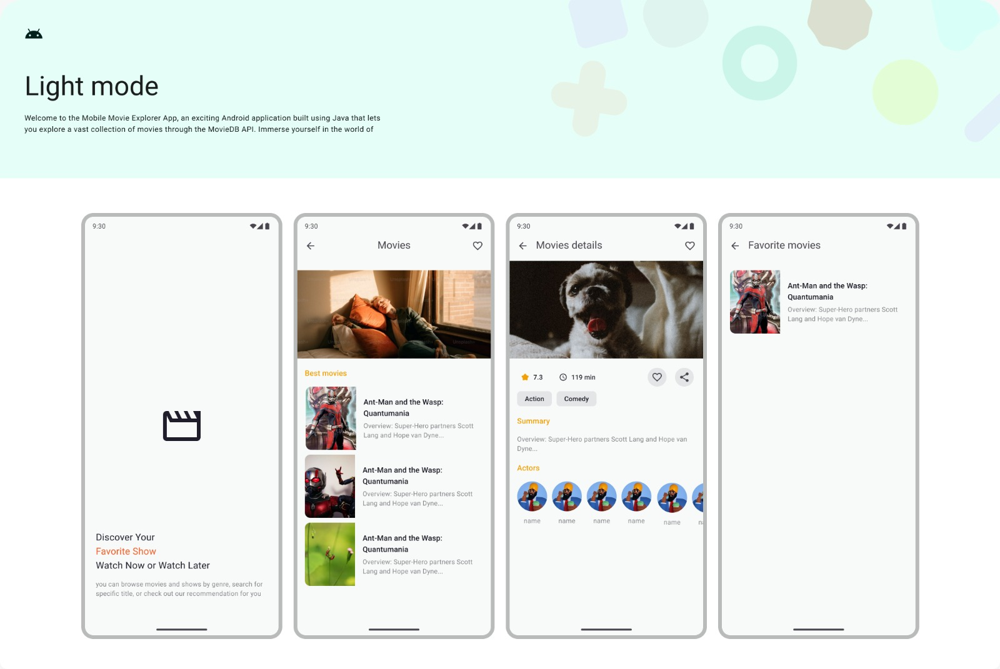
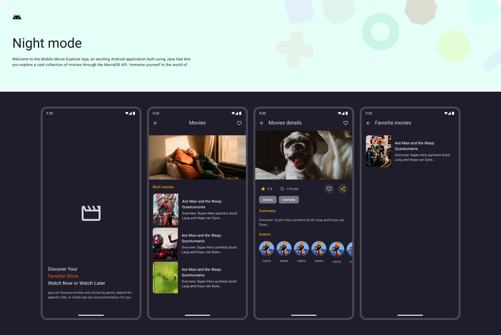
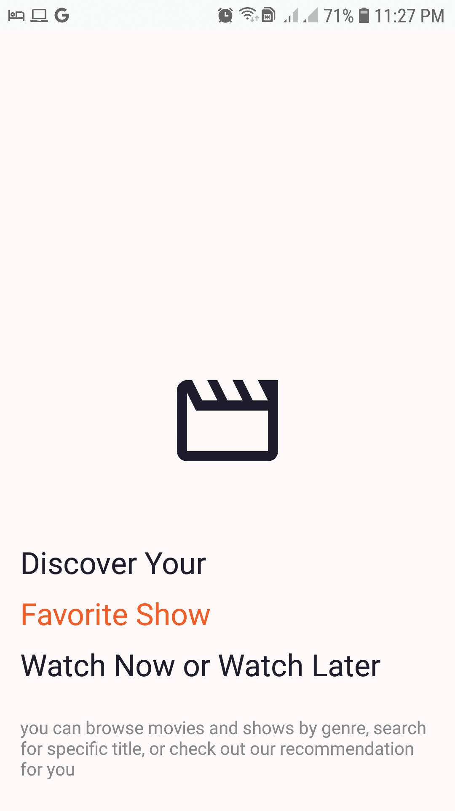
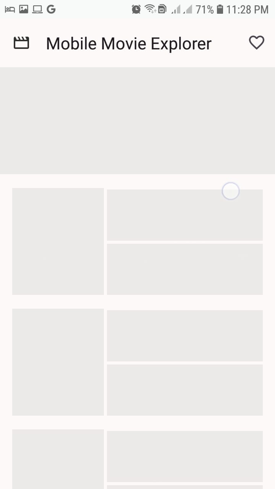
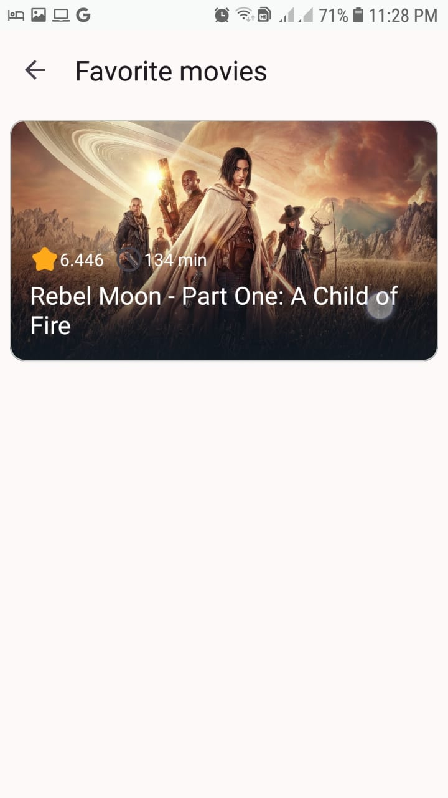
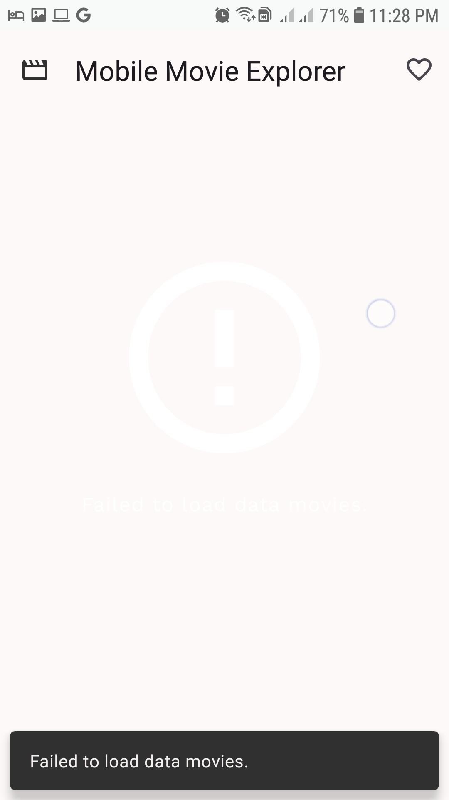

# Mobile Movie Explorer

## Introduction
This is a movie  application built with the goal to create a task for client in Upwork  based on the MVVM architectural pattern using API (https://app-vpigadas.herokuapp.com).

See below for more information.

## Technologies & Architecture

#### Technologies
* Android, Java
* [The Movie Database](https://app-vpigadas.herokuapp.com)
* [Retrofit HTTP Client](https://square.github.io/retrofit/)
* [RxJava](https://github.com/ReactiveX/RxJava/) - asynchronous programming
* [Dagger and Hilt](https://github.com/google/dagger/) - Dependency Injection
* [Glide](https://github.com/bumptech/glide/) - Loading images, caching
* [Shimmer](https://github.com/facebookarchive/shimmer-android/) - Animation for images

#### Architecture
Model-View-ViewModel (MVVM)

#### Architecture Components
[ViewModel](https://developer.android.com/topic/libraries/architecture/viewmodel), [LiveData](https://developer.android.com/topic/libraries/architecture/livedata), [DataBinding](https://developer.android.com/topic/libraries/data-binding),
[Navigation](https://developer.android.com/guide/navigation/)

## Features
**Splash Screen:**

**Home:** Best movie and lists of popular, in theaters and upcoming movies

**Movie details:** Title, genres, rating, overview, date, runtime, language, and cast

**Favorite Movies:** Movies selected favorite button in details screen that shows in Favorite movies screen.

## Screenshots

### Light and dark mode

  
  

### Home | Favorite | Animation | Details | Error

  
  
  

## Setup

#### Requirements
* Basic knowledge about Android Studio

##### Downloads
* [Mobile Movie Explorer Apk](https://github.com/Case-Code/MobileMovieExplorer/actions/runs/7479743128/artifacts/1160486356)
